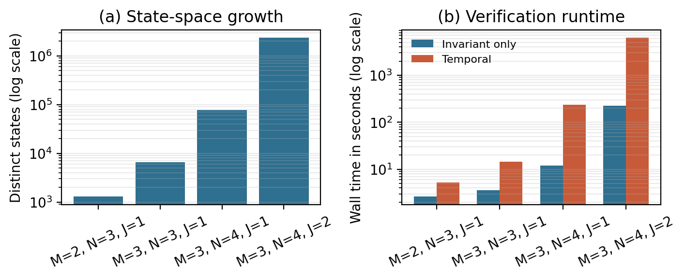
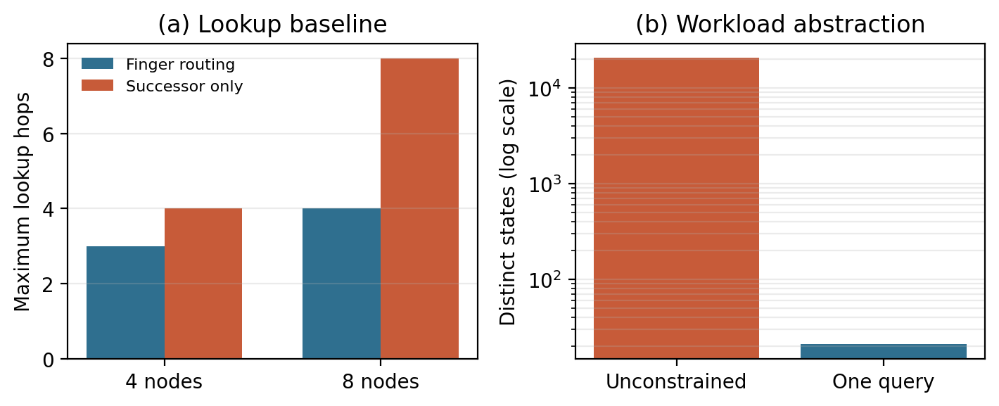

# CS4720 TLA+ Chord Model

This repository contains TLA+ models of the Chord protocol for CS4720 Research
in Software Analysis, project variant A.

Report draft:
https://www.overleaf.com/project/6a0357b148b03f2bd71e5f1e

## Query Abstraction

The variable `queries` is a global set of lookup records:

```tla
[origin |-> n, target |-> k, curr |-> n, result |-> NoResult]
```

- `origin`: node that started the lookup.
- `target`: key being resolved.
- `curr`: node currently handling the lookup.
- `result`: `NoResult` while unresolved, otherwise the resolved successor node.

This abstracts away concrete RPC messages. Each `AdvanceQuery` step represents
one lookup hop in the Chord paper's `find_successor` flow.

## Correctness Properties

The configs currently verify:

- `TypeOK`: all mutable state has the expected shape.
- `LookupCorrect`: every completed lookup resolves to `TrueSucc(target)`,
  the mathematically correct Chord successor for the static ring.
- `SuccessorCoreReachable`: every active node's successor chain reaches the
  initial ring, excluding a disconnected successor cycle made only of joining
  nodes.
- `EventuallyStableAfterJoins`: after all configured joins occur, the dynamic
  ring eventually has mathematically correct successor, predecessor, and
  finger-table entries.

## Running TLC

Use the TLA+ Toolbox, the VS Code TLA+ extension, the `tlc` command, or
`tla2tools.jar`.

With the `tlc` command:

```sh
tlc -config ChordStatic.cfg ChordStatic.tla
tlc -config configs/static-m2-basic.cfg ChordStatic.tla
tlc -config configs/static-m3-one-query.cfg ChordStatic.tla
tlc -config configs/static-m3-wrap-one-query.cfg ChordStatic.tla
tlc -coverage 1 -config configs/static-m3-one-query-runtime.cfg ChordStatic.tla
```

With `tla2tools.jar` from PowerShell:

```powershell
$env:TLA2TOOLS_JAR = "C:\path\to\tla2tools.jar"
java -cp $env:TLA2TOOLS_JAR tla2sany.SANY ChordStatic.tla
java -cp $env:TLA2TOOLS_JAR tlc2.TLC -config ChordStatic.cfg ChordStatic.tla
```

## Controlled Week 3 Experiments

The Week 3 evaluation uses one fixed setup for every timing:

- TLC `2026.05.18.174321`.
- OpenJDK `21.0.9`.
- `-Xms4g -Xmx4g -XX:+UseParallelGC`.
- One TLC worker.
- `-lncheck final`, which performs liveness analysis once on the completed
  state graph rather than repeatedly during generation.
- The same Intel Core i7-6700HQ machine with 15.9 GiB RAM.
- One exhaustive run per configuration.

The runner measures process wall time with a high-resolution stopwatch. This
includes JVM startup, parsing, state generation, and temporal analysis. It also
records generated states, distinct states, graph depth, and generated-state
throughput.

The dynamic matrix is:

| Scenario | `M` | Initial nodes | Joining nodes | Final active nodes | Modes |
| --- | ---: | ---: | ---: | ---: | --- |
| `M2-N3-J1` | 2 | 2 | 1 | 3 | invariant, temporal |
| `M3-N3-J1` | 3 | 2 | 1 | 3 | invariant, temporal |
| `M3-N4-J1` | 3 | 3 | 1 | 4 | invariant, temporal |
| `M3-N4-J2` | 3 | 2 | 2 | 4 | invariant, temporal |

The two four-node scenarios converge to the same final node set
`{0, 2, 4, 6}`, isolating the effect of one versus two joins.

Run the complete matrix and both baselines:

```powershell
powershell -ExecutionPolicy Bypass -File scripts\run_week3_experiments.ps1 `
  -Tla2ToolsJar "C:\path\to\tla2tools.jar" `
  -MetaRoot "D:\tlc-chord-week3"

python -m pip install -r requirements-evaluation.txt
python scripts\generate_week3_figures.py
```

The runner writes `evaluation/week3_results.csv`, `evaluation/environment.json`,
and one raw TLC log per experiment under `evaluation/logs/`.

To reproduce one reported row instead of the full matrix, pass its experiment
identifier. The optional command below creates the gitignored
`evaluation/reproduction/` scratch directory; a full matrix run does not:

```powershell
powershell -ExecutionPolicy Bypass -File scripts\run_week3_experiments.ps1 `
  -Tla2ToolsJar "C:\path\to\tla2tools.jar" `
  -MetaRoot "D:\tlc-chord-week3" `
  -OutputDirectory "evaluation\reproduction" `
  -Only "dynamic-m3-n4-two-joins-temporal"
```

The default config uses:

```tla
M = 2
Nodes = {0, 2}
```

## Static Model Notes

Unconstrained `M = 3` configs with all query records enabled grow into millions
of states, so larger verification runs should use `OneQueryConstraint` or a more
compact query abstraction.

The static configs disable TLC deadlock checking because query records are
retained after completion. Once the bounded workload has resolved, no further
transition is expected; this terminal state represents completion rather than a
protocol deadlock.

For a representative wraparound lookup with `M = 3` and
`Nodes = {1, 4, 6}`, a query from node `1` for target `0` is forwarded to node
`6`, which resolves it to successor node `1`.

## Dynamic Join Abstraction

`ChordDynamic.tla` models dynamic transitions:

- `Join(n)`: a configured joining node enters the active ring.
- `Stabilize(n)`: a node consults its successor's predecessor and sends an
  asynchronous notification.
- `DeliverNotify(msg)`: a notification message is delivered nondeterministically
  from the global `notifyMsgs` set.
- `FixFingers(n)`: a node repairs one finger-table slot and advances
  `nextFinger[n]`.

`nextFinger[n]` starts at `1` and cycles through `1..M`. This round-robin
schedule replaces the paper's random finger selection. A join does not repair
existing tables atomically: old entries, and some entries initialized for the
new node, can temporarily be stale while still pointing to active nodes.

The dynamic model keeps the same bounded identifier-ring abstraction as the
static model. `notifyMsgs` abstracts RPC delivery and permits out-of-order
notification handling. In the Chord paper, a joining node asks a known contact
node to route `find_successor`. Here, `Join` directly uses the mathematical
successor in the active ring, while the static model separately covers
lookup-hop behavior. Consequently, the dynamic model does not capture a join
lookup being delayed, misrouted by stale routing information, or failing.

Dynamic configs enable deadlock checking because active nodes can always run
periodic stabilization or finger repair. Static configs disable it because their
bounded lookup experiments intentionally reach terminal completed states.

The liveness property is:

```tla
EventuallyStableAfterJoins == AllJoinsDone ~> StableRing
```

This is a batch-oriented property. With multiple configured joiners, it
requires convergence after all of them are active; it does not require the ring
to stabilize between individual joins.

For the one-join configuration, the initial ring is `{0, 4}` and node `2`
joins:

1. `Join(2)` sets `succ[2] = 4` and `pred[2] = Nil`.
2. `Stabilize(2)` sends notification `2 -> 4`; delivery changes `pred[4]` to
   `2`.
3. `Stabilize(0)` observes that `2` lies between `0` and successor `4`, changes
   `succ[0]` to `2`, and sends notification `0 -> 2`.
4. Delivery changes `pred[2]` to `0`, producing the correct ring
   `0 -> 2 -> 4 -> 0`.
5. Repeated `FixFingers` actions repair the remaining stale finger entries.

`Spec` adds weak fairness for each configured join, each node's `stabilize` and
`fix_fingers` actions, and each concrete notification message. 
Run the dynamic configs with:

```sh
tlc -config ChordDynamic.cfg ChordDynamic.tla
tlc -config configs/dynamic-m3-one-join.cfg ChordDynamic.tla
tlc -coverage 1 -config configs/dynamic-m3-one-join-runtime.cfg ChordDynamic.tla
tlc -config configs/dynamic-m3-one-join-invariant.cfg ChordDynamic.tla
tlc -config configs/dynamic-m3-two-joins-invariant.cfg ChordDynamic.tla
tlc -config configs/dynamic-m3-two-joins.cfg ChordDynamic.tla
```

## Controlled Week 3 Results

All values below come from `evaluation/week3_results.csv`. Wall time includes
JVM startup and parsing.

| Scenario | Mode | Generated | Distinct | Depth | Wall time | Generated states/s |
| --- | --- | ---: | ---: | ---: | ---: | ---: |
| `M2-N3-J1` | invariant | 10,209 | 1,296 | 16 | 2.629s | 3,883.9 |
| `M2-N3-J1` | temporal | 10,209 | 1,296 | 16 | 5.206s | 1,960.9 |
| `M3-N3-J1` | invariant | 51,409 | 6,516 | 21 | 3.558s | 14,447.1 |
| `M3-N3-J1` | temporal | 51,409 | 6,516 | 21 | 14.625s | 3,515.2 |
| `M3-N4-J1` | invariant | 810,541 | 77,976 | 27 | 12.113s | 66,915.4 |
| `M3-N4-J1` | temporal | 810,541 | 77,976 | 27 | 235.580s | 3,440.6 |
| `M3-N4-J2` | invariant | 25,309,837 | 2,345,796 | 35 | 226.748s | 111,621.0 |
| `M3-N4-J2` | temporal | 25,309,837 | 2,345,796 | 35 | 6,223.400s | 4,066.9 |

At fixed `N=3` and one join, increasing `M` from 2 to 3 increases distinct
states by `5.0x`. At fixed `M=3` and one join, increasing the final active-node
count from three to four increases them by `12.0x`. For the same final
four-node ring, changing from one join to two joins increases them by `30.1x`.

The temporal and invariant runs reach identical protocol states. Temporal
checking is nevertheless between `2.0x` and `27.4x` slower. TLC must record the
transition and fairness graph while generating states and then search it for a
fair cycle violating eventual stabilization. In the largest run, final cycle
analysis takes 6m29s, while the full temporal run takes 1h43m; most of the
remaining overhead comes from constructing the liveness graph at much lower
state throughput.



## Baselines

The first baseline replaces finger-table forwarding with successor-only linear
forwarding while keeping initialization, queries, and `LookupCorrect`
identical. Because the one-query state graph starts with `Init` and
`StartQuery`, maximum lookup hops equal TLC depth minus two.

| Ring | Routing | Maximum lookup hops | Distinct states |
| --- | --- | ---: | ---: |
| `M=3`, 4 nodes | fingers | 3 | 97 |
| `M=3`, 4 nodes | successor only | 4 | 113 |
| `M=4`, 8 nodes | fingers | 4 | 449 |
| `M=4`, 8 nodes | successor only | 8 | 705 |

At eight nodes, finger routing halves the maximum modeled lookup length and
reduces distinct states by `36.3%`. The second comparison evaluates the
`OneQueryConstraint`: for `M=2` and nodes `{0,2}`, it reduces distinct states
from 20,736 to 21, a `987x` reduction. This justifies the bounded workload used
for larger static rings while also showing that it omits concurrent-query
interleavings.



## SysMoBench Metrics

The artifact adapts three SysMoBench metrics:

| Metric | Result | Evidence |
| --- | ---: | --- |
| Syntax correctness | 100% (2/2 modules) | SANY accepts `ChordStatic.tla` and `ChordDynamic.tla`. |
| Runtime correctness | 100% (7/7 action families) | TLC executes the six protocol actions and the `AdvanceQueryLinear` baseline without runtime errors. |
| Invariant correctness | 100% (5/5 obligations) | Both `TypeOK` checks, `LookupCorrect`, `SuccessorCoreReachable`, and `EventuallyStableAfterJoins` pass the recorded configurations. |

Runtime correctness is measured with the two `*-runtime.cfg` files and TLC's
`-coverage 1` option, supplemented by the successor-only baseline run. Trace
conformance is not evaluated because the project models the Chord paper and
does not include an instrumented Chord implementation or implementation
traces.
